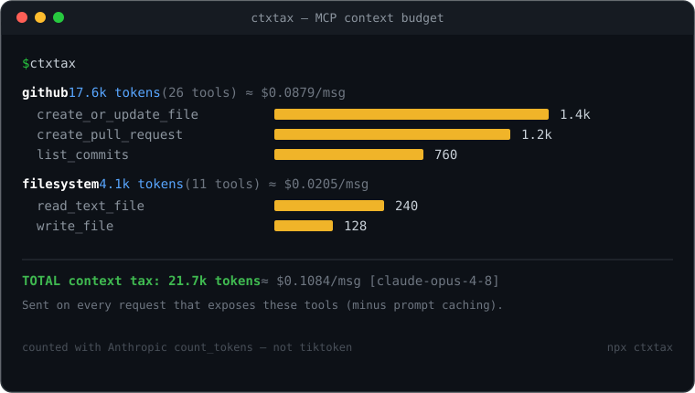

<div align="center">

# 🧮 ctxtax

### 一行指令，看清你接的每個 MCP server / 每個工具，在每次 Claude 請求裡吃掉多少 context token —— *還沒開口就已經在付費。*

[](https://www.npmjs.com/package/ctxtax)
[](LICENSE)
[](https://nodejs.org)
[](https://www.typescriptlang.org/)
[](https://modelcontextprotocol.io)
[](https://claude.com)
[](#參與貢獻)

`#mcp` · `#claude` · `#anthropic` · `#tokens` · `#context-window` · `#cli` · `#linter`

<samp>[English](README.md) · [简体中文](README.zh-CN.md) · **繁體中文** · [日本語](README.ja.md) · [한국어](README.ko.md) · [Español](README.es.md) · [Français](README.fr.md) · [Deutsch](README.de.md) · [Português](README.pt-BR.md)</samp>

[為什麼要精確](#為什麼必須精確計數) · [運作原理](#運作原理) · [安裝](#安裝) · [使用](#使用) · [Lint](#lint給-mcp-server-作者) · [Tool Search 建模](#tool-search-建模) · [CI 預算閘](#在-ci-中強制-context-預算) · [藍圖](#藍圖)



</div>

---

你每接一個 MCP 工具，它的 JSON schema 就會被塞進模型上下文，**每一次**請求都重送。幾個 server 疊起來，輕鬆在你說出第一句話之前就吃掉 3–6 萬 token 的「上下文稅」—— 每一輪都在付，還排擠掉你真正想用的視窗。

`ctxtax` 連接你的 MCP server，讀取它們真實的工具定義，依工具、依 server 告訴你成本 —— token 數 + 美元。

```text
github  17.6k tokens (26 tools)  ≈ $0.0879/msg
  create_or_update_file      ████████████████████████████ 1.4k
  create_pull_request        ████████████████████████ 1.2k
  list_commits               ███████████████ 760
  ...
filesystem  4.1k tokens (11 tools)  ≈ $0.0205/msg
  ...
────────────────────────────────────────────────
TOTAL context tax: 21.7k tokens  ≈ $0.1084/msg  [model: claude-opus-4-8]
These tokens are sent on every request that exposes these tools (minus prompt caching).
```

## 為什麼必須精確計數

大多數「token 計數」工具用的是 `tiktoken`。**那是 OpenAI 的分詞器 —— 對 Claude 會低估約 15–20%，對 JSON schema 與非英文更糟。** 一個差 20% 的預算工具，比沒有還糟。

`ctxtax` 依 Claude 真正的計數方式來：呼叫 Anthropic 官方的 [`/v1/messages/count_tokens`](https://platform.claude.com/docs/en/build-with-claude/token-counting) 端點（免費、依模型區分）。設定 `ANTHROPIC_API_KEY` 就是精確值；沒有 key 也會給一個**明確標註**的估算 —— 絕不拿一個數字假裝精確。

## 運作原理

1. **探索** —— 讀取你的 `.mcp.json`（或直接給一個 server 指令）。
2. **連線** —— 透過 stdio 或 Streamable HTTP 走 MCP，呼叫 `tools/list` 取得**真實** schema，與你的用戶端送給模型的完全一致。
3. **計數** —— 把每個工具轉成 Anthropic 工具格式，量測它的**邊際**成本：`count_tokens(含該工具) − count_tokens(基準)`。
4. **報告** —— 依 server 輸出排序長條圖、總計，以及依你所選模型輸入價算出的 $/則訊息。

## 安裝

```bash
npm install -g ctxtax          # 或：npx ctxtax
export ANTHROPIC_API_KEY=sk-ant-...   # 選用，但建議設定以取得精確計數
```

## 使用

```bash
ctxtax                       # 掃描 ./.mcp.json
ctxtax -c path/to/.mcp.json  # 指定設定檔
ctxtax -s github             # 只掃設定裡的某一個 server
ctxtax -m claude-sonnet-4-6  # 依另一個模型計數/計價
ctxtax --json                # 機器可讀輸出
ctxtax lint                  # 給 MCP server 作者的省 token 建議
ctxtax toolsearch            # 模擬 deferred(Tool Search) 與 always-loaded 成本
ctxtax --html report.html --badge docs/context-cost.svg   # 可分享卡片 + README 徽章
ctxtax -- npx -y @modelcontextprotocol/server-filesystem /tmp   # 臨時跑一個 server（放在 -- 之後）
```

`.mcp.json` 就是 Claude Code / Claude Desktop 的標準格式：

```json
{
  "mcpServers": {
    "filesystem": { "command": "npx", "args": ["-y", "@modelcontextprotocol/server-filesystem", "/tmp"] },
    "github": { "url": "https://api.githubcopilot.com/mcp/" }
  }
}
```

### Lint（給 MCP server 作者）

`ctxtax lint` 指出是什麼讓你的工具變貴 —— 過長的 description（精確測量）、臃腫的 schema、超大 enum、冗餘 title —— 並估算你能省下的 token：

```text
filesystem / search_files
  ✖ [long-description] description is ~121 tokens (target ≤ 120). Keep only what Claude needs… (~1 token saveable)
  • [verbose-tool] the whole tool is ~206 tokens — among the most expensive; trim the schema or split it.
────────────────────────────────────────────────
27 findings  ~859 tokens/msg recoverable
```

### Tool Search 建模

Anthropic 的 [Tool Search](https://platform.claude.com/docs/en/agents-and-tools/tool-use/tool-search-tool) 會延遲載入工具定義 —— 按需載入而非全部預先載入。`ctxtax toolsearch` 估算開啟它後你**預先**要付多少，對比 always-loaded 成本：

```text
  server                 always  deferred↑   note
  filesystem               4.1k        0.6k   stdio — deferrable
  github                  17.6k       17.6k   HTTP/Streamable — not deferred today (#40314)
always-loaded total: 21.7k tokens
deferred upfront:     18.2k tokens (−3.5k upfront; the rest loads on demand)
```

它揭示的關鍵點：**stdio server 可延遲，但 HTTP/Streamable MCP server 目前不會被延遲**（[claude-code#40314](https://github.com/anthropics/claude-code/issues/40314)）—— 它們無論如何都要預先付全價。（估算：可延遲的 server 被建模為在搜尋索引裡只保留 name + 一行 stub。）

### 可分享報告與徽章

`--html` 寫出一個自包含的 HTML 預算卡片（打開即看、可分享）；`--badge` 寫出一個 README 徽章。

```bash
ctxtax --html report.html              # 可分享的 HTML 卡片（無外部相依）
ctxtax --badge docs/context-cost.svg   # 靜態 SVG 徽章（或 .json = shields.io endpoint）
```

然後把它放進 README：``。

## 在 CI 中強制 context 預算

`ctxtax ci` 把預算變成一道檢查。當 MCP 上下文稅超過門檻時讓建置失敗，並在 PR 上貼出**差異**——*「這個 PR 加了 4 個工具 = 每則訊息 +3,200 tokens」*。（Claude Code 的 `/context` 互動時很好用，但它進不了 CI；這個可以。）

```bash
# 本機：存一份提交進倉庫的預算快照
ctxtax ci --save                       # 寫入 .ctxtax.json

# CI 中：超預算就失敗、與基準分支的快照做差異、在 PR 上留言
ctxtax ci --max-tokens 30000 --baseline .ctxtax.base.json --comment out.md --summary
```

開箱即用的 GitHub Action：

```yaml
# .github/workflows/ctxtax.yml
name: ctxtax
on: pull_request
permissions:
  contents: read
  pull-requests: write
jobs:
  budget:
    runs-on: ubuntu-latest
    steps:
      - uses: actions/checkout@v4
      - uses: HarryXin0919/ctxtax@v0.1.0
        with:
          max-tokens: "30000"
          anthropic-api-key: ${{ secrets.ANTHROPIC_API_KEY }}   # 選用；用於精確計數
```

該 Action 會抓取基準分支的 `.ctxtax.json`，渲染逐工具的差異，建立/更新同一則 PR 留言，寫入 job summary，並在你超預算時讓檢查失敗。

## 藍圖

`scan`、`ci`、`lint`、`toolsearch`、`--html`/`--badge` 都已 ship。後續想法（歡迎 PR）：計入 prompt 快取的真實成本、編輯器外掛。有想法？[開個 issue](../../issues)。

## 參與貢獻

歡迎 Issue 與 PR。`npm install`，接著 `npm run dev -- -- npx -y @modelcontextprotocol/server-filesystem /tmp` 即可在本機試用。

## 授權

[MIT](LICENSE) © Harry Xin
